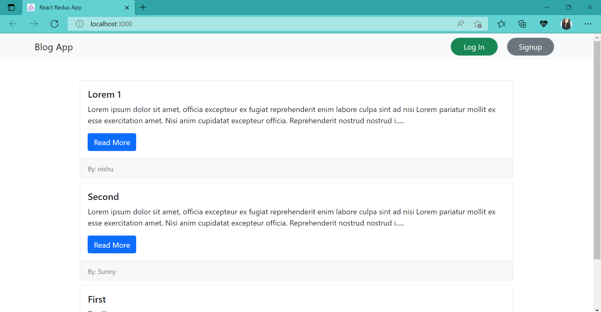
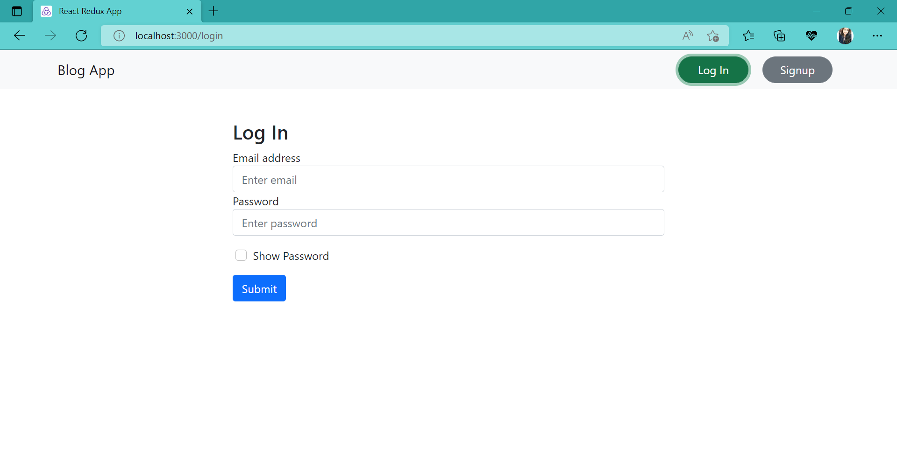
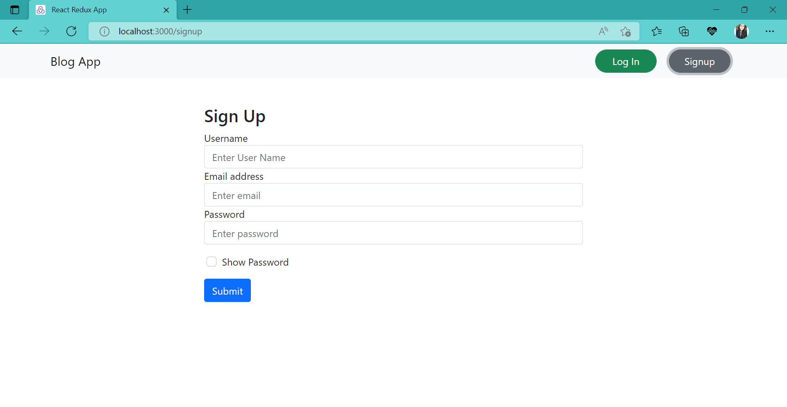
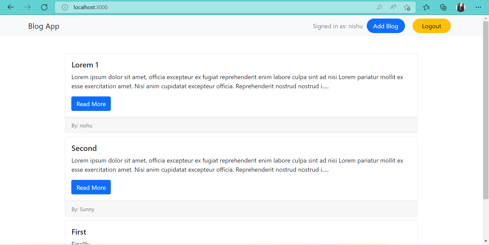
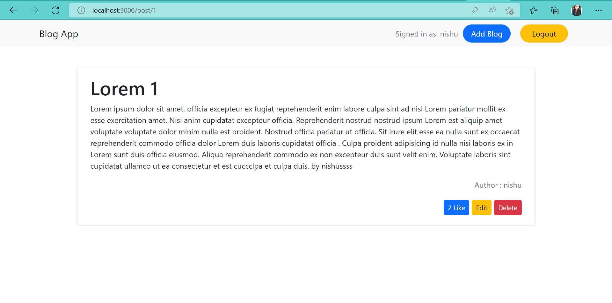
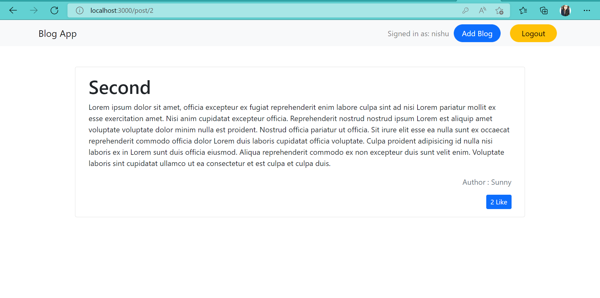
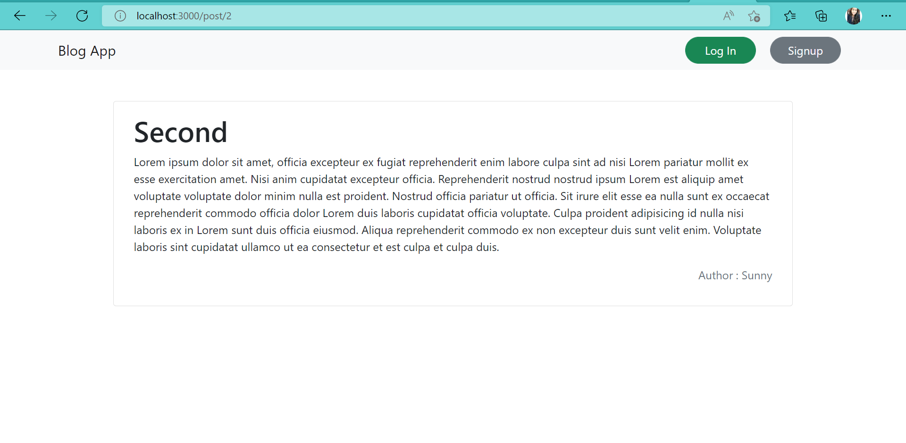
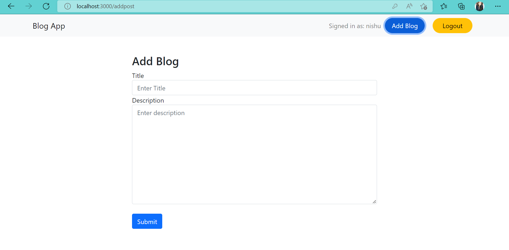
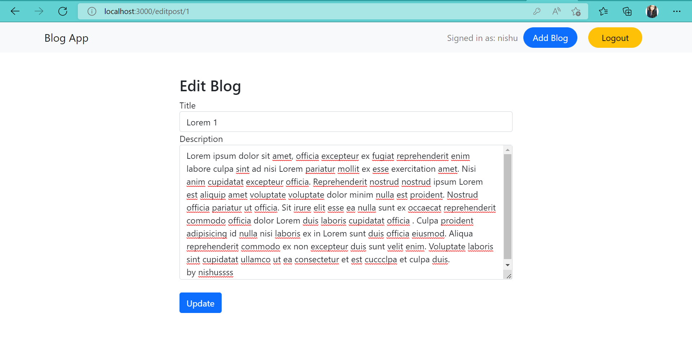

<div align="center">

# Blog App [:link:](http://nutritious-book.surge.sh/)
# React-Redux App

#
</div>

## Run Locally

### 1. Clone repo

```
$ git clone https://github.com/Yashika1410/blog-app-react-redux.git
$ cd blog-app-react-redux
```
### 2. Setup & start project

```
$ npm install
$ npm start
```
## Project ScreenShot's
### Home Page 
<p align="center"></p>


### User Login & Signup 

<p align="center"></p>
<p align="center"></p>

### Home Page after login

<p align="center"></p>

### Post Page

* If Post is posted by user 

<p align="center"></p>

* If Post is posted by other user
<p align="center"></p>

* If User is not Logged In
<p align="center"></p>

### Add Blog Page 
<p align="center"></p> 

### Edit Blog page
<p align="center"></p>


